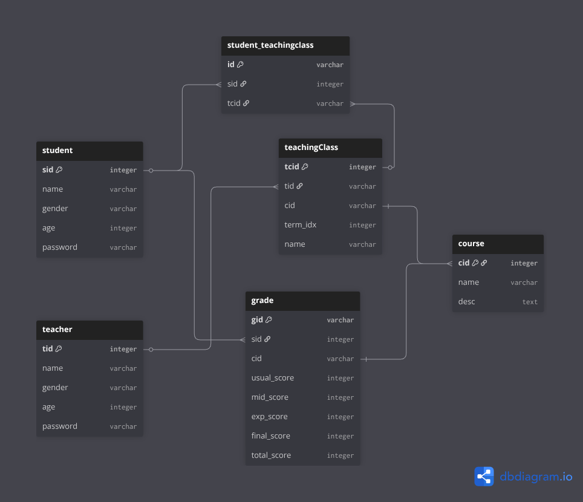
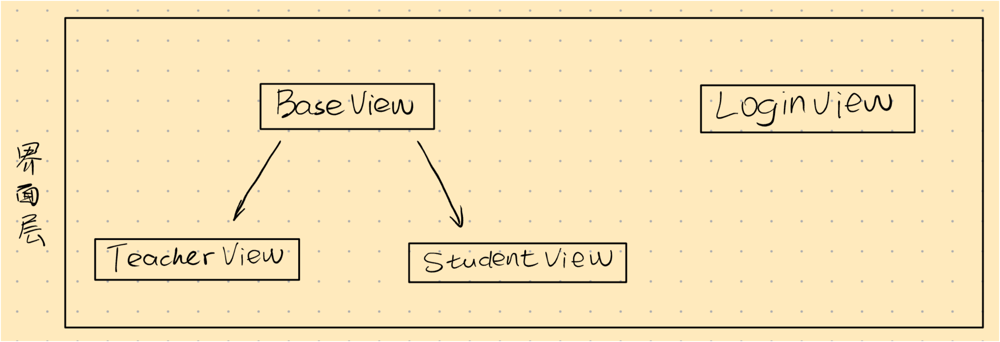
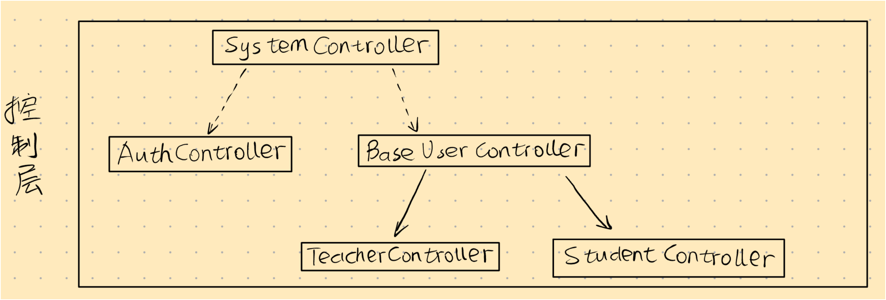
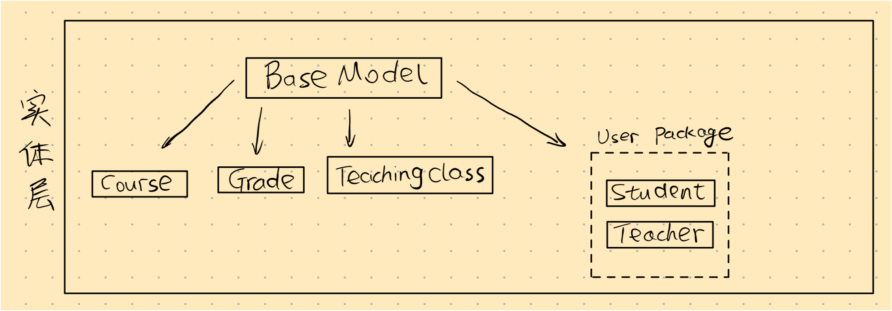

# 基于命令行的学生成绩管理系统

## 软件功能

本系统是一款基于命令行界面的学生成绩管理系统，旨在为师生提供便捷、高效的成绩与信息管理功能。系统主要面向两类用户：**学生**与**教师**，并通过基于角色的权限控制机制，确保不同角色拥有相应的操作权限。

### 1. 学生功能

学生登录系统后，可以执行以下操作：

* **课程管理**：查看自己所选课程列表；
* **成绩查询**：查询个人成绩信息；
* **个人信息管理**：查看并修改个人基本信息；
* **系统操作**：查看可用指令、清空屏幕或安全退出系统。

### 2. 教师功能

教师登录系统后，可进行教学班级与成绩管理，包括：

* **成绩统计**：查看某教学班的成绩分布图；
* **成绩查询**：查看教学班学生成绩列表，并支持自定义排序键与升降序方式；
* **成绩录入与修改**：录入新成绩或更新已有成绩；
* **个人信息管理**：查看并编辑教师个人信息；
* **系统操作**：查看操作指令、清屏、退出登录等。

### 3. 系统管理与数据持久化

为保证数据一致性与系统的可持续使用，系统设计了以下通用功能：

* **登录与权限控制**：通过账户验证与角色识别实现安全登录与操作隔离；
* **数据持久化**：支持数据在程序退出后自动保存，并在下次启动时加载之前的状态；
* **文件化数据存储**：仿照数据库设计思路，系统采用多文件结构实现数据表功能，通过唯一标识符实现表间关联，从而确保数据结构清晰、扩展性强。

## 设计思路

本软件的开发遵循标准的面向对象开发流程，使用UML进行软件建模。首先根据功能需求绘制用例图，更清晰地显示各角色与系统功能的关系：

然后根据这些用例，进行数据库底层数据文件的设计，构建概念模型和逻辑模型：绘制ER图和数据模型图。


ER图如上所示，系统中包含学生、教师、教学班、课程和成绩五个实体。学生实体通过学号唯一标识，记录姓名、性别、年龄和登录密码等信息；教师实体以教工号为主键，记录姓名、性别和登录密码；教学班实体包含教学班号、开课学期和教学班名称，并与教师形成一对多关系（一个教师可负责多个教学班），同时与课程形成多对一关系（一个教学班对应一门课程）；成绩实体以成绩编号为主键，记录平时成绩、期中成绩、期末成绩、实验成绩和综合成绩，并通过关联学生和教学班来表示某学生在某教学班中的成绩情况；课程实体以课程编号为主键，包含课程名称和课程描述。



数据模型图如上所示，展示了学生成绩管理系统在数据库中的表结构实现，它与之前的ER图在逻辑上完全对应。系统包含五个主要数据表：`student`、`teacher`、`course`、`teachingClass`、`grade`，以及一个用于实现多对多关系的中间表 `student_teachingclass`。其中，`student` 表对应ER图中的“学生”实体，保存学号、姓名、性别、年龄和密码等信息；`teacher` 表对应“教师”实体，记录教工号、姓名、性别、年龄和密码；`course` 表对应“课程”实体，包含课程编号、名称和描述；`teachingClass` 表对应“教学班”实体，通过外键 `tid` 关联教师、`cid` 关联课程，并记录开课学期（`term_idx`）和教学班名称，实现“一个教师可负责多个教学班，一个教学班只属于一个课程”的一对多、多对一关系；`student_teachingclass` 是学生与教学班之间的关联表，用于表示学生选课关系，对应ER图中“学生与教学班多对多”的关系；`grade` 表则对应“成绩”实体，通过 `sid` 和 `cid` 外键分别关联学生和课程，记录平时、期中、实验、期末及总成绩等信息，用于反映某学生在某门课程中的成绩情况。整体上，这个数据库模型是ER图的具体表结构化实现，清晰地体现了学生、教师、课程、教学班与成绩之间的逻辑联系。

然后在用例图和数据库设计图的基础上构思系统中包含的类，明确各类之间的关系与职责分配。本软件在设计的时候遵循了经典的**MVC（Model-View-Controller）设计模式**，将系统整体上划分为实体层（Model）、视图层（View）和控制层（Controller）三个核心部分，以实现数据、表示和逻辑的有效分离，从而提高代码的模块化、可维护性和可扩展性。

**Model**：模型层负责封装系统的数据结构和业务逻辑，直接与数据持久化层交互。在本系统中，模型层由一系列实体类构成，每个类都与数据库中的一个表相对应。具体来说，这个系统包含了五个实体类：`Student` (学生类)、`Teacher` (教师类)、`Course` (课程类)、`TeachingClass` (教学班类) 和 `Grade` (成绩类)：这五个实体类分别封装了学生、教师、课程、教学班和成绩的属性信息和基本操作。例如，`Student` 类包含了学号、姓名、密码等字段，并可能包含验证密码、更新个人信息等方法。这一层是整个应用的核心，确保了数据的完整性和一致性。

**View**：视图层是用户与系统交互的界面，在本命令行系统中，它负责向用户展示信息（如菜单、查询结果）和接收用户的输入指令。视图层本身不包含任何业务逻辑，其主要职责是数据的呈现。
* `LoginView` (登录视图)：负责显示登录界面，接收用户输入的账号和密码。
* `StudentView` (学生视图)：当学生成功登录后，此视图负责展示学生专属的操作菜单，如查询成绩、查看课程等，并显示操作结果。
* `TeacherView` (教师视图)：当教师成功登录后，此视图负责展示教师的操作菜单，如成绩录入、成绩统计、查看教学班学生列表等，并将结果格式化输出给教师。

**Controller**：控制层是模型与视图之间的桥梁，负责处理用户的输入请求，调用相应的模型进行数据处理，并根据处理结果更新视图。它构成了应用的主体逻辑。
* `SystemController` (系统控制器)：作为系统的总控制器，它负责程序的启动、初始化、处理用户登录和注销的逻辑。它接收来自 `LoginView` 的登录请求，调用 `Student` 或 `Teacher` 模型进行身份验证，并根据验证结果决定加载 `StudentController` 还是 `TeacherController`。
* `StudentController` (学生控制器)：负责处理学生角色的所有业务逻辑。当学生在 `StudentView` 中选择一个操作（如“查询成绩”）时，`StudentController` 会接收该请求，调用 `Grade` 和 `Course` 等模型来获取该生的成绩数据，最后将数据传递给 `StudentView` 进行显示。
* `TeacherController` (教师控制器)：负责处理教师角色的所有业务逻辑。例如，当教师通过 `TeacherView` 提交一个班级的成绩时，`TeacherController` 会接收数据，调用 `Grade` 模型将成绩存入数据文件，并指令 `TeacherView` 显示操作成功的消息。

通过这种MVC架构，系统的职责划分变得非常清晰：`Model` 关心“是什么”（数据），`View` 关心“长什么样”（界面），而 `Controller` 则关心“做什么”（逻辑）。当需要修改界面显示方式时，只需调整 `View` 层的代码；当业务规则发生变化时，只需修改 `Controller` 和 `Model`，三者互不干扰，极大地提升了软件的开发效率和质量。

## 程序架构

在实际进行程序开发的时候，为了保持程序的可维护性和可扩展性，又在基本的分析类基础上新增了 BaseView 作为视图基类，新增了 BaseUser 作为用户基类，将身份验证流程从 SystemController 中独立出来作为单独的一个 AuthController 类，专门负责身份验证相关的功能，避免 SystemController 类过于复杂。最终的系统还是包含三个层次的结构，分别如下图所示。



首先是界面层，登陆界面类相对独立，有一套自己的显示逻辑，直接与 SystemController 进行交互并渲染信息；由于学生视图和教师视图功能重合度较高，因此抽象出一个 BaseView 类作为父类，封装公共方法和属性。另外这种封装也在 SystemController 中能够用统一的变量类型来描述界面类，方便后续新增更多的角色视图，例如管理员视图。



然后是控制层，最外层的 SystemController 负责整个系统的行为调度，其功能的执行依赖于 AuthController 和 BaseUser 及其派生类 TeacherController 与 StudentController



最后是实体层，有一个公共基类 BaseModel 封装了对数据文件的读取和写入功能，并在此基础上派生出五个不同的实体类，Student 和 Teacher 属于用户类，因此被单独放入 user package 当中。

## 执行流程图

分不同的功能展示UML顺序图：


## 类间关系

程序的入口是App类，它负责创建并运行SystemController；SystemController作为系统核心控制器，创建并管理BaseUserController、AuthController、TeacherController和StudentController等子控制器，同时持有BaseView以负责界面显示。BaseUserController拥有对用户相关控制器（TeacherController和StudentController）的引用，用于统一用户管理逻辑；AuthController与BaseModel交互完成身份验证操作，BaseModel则作为数据模型基类被Student、Teacher、Grade、Course和TeachingClass等类继承或使用。StudentController和TeacherController负责调用对应的模型与视图（StudentView与TeacherView），实现学生与教师的业务功能。BaseView是视图层基类，LoginView、StudentView、TeacherView均继承自它，用于展示不同角色的界面。模型层中，Student和Teacher类通过Grade类建立联系，表示成绩的拥有关系；学生通过选课与TeachingClass产生多对多关系，而TeachingClass与Course之间是包含关系，每个教学班由一个教师负责。整体上，控制层管理流程逻辑，模型层承载数据结构与关系，视图层负责信息展示，三者通过依赖与组合关系协同工作，构成完整的面向对象系统结构。


## 人工智能使用情况

## 附录

### 常用命令

```bash
# 测试代码
mvn test -Dtest=MainTest

# 运行程序
mvn compile && mvn exec:java
```

### TODO

- [x] 完善功能性需求
- [x] 实现控制类框架
- [x] 实现界面类
- [x] 实现各种实体类及其方法
- [x] 设计底层数据文件的数据格式
- [x] 打印一个美观的banner
