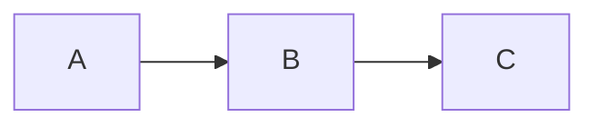

## 标注转化测试
### 默认模式

转化前源代码：

```md
> [!NOTE] Title
> Contents
```

转化前OB中的效果：

> [!NOTE] Title
> Contents

### 不同类型

`note` 类型的标注：

> [!note] Title
> 这是一个 `note` 类型

`warning` 类型的标注：

> [!warning] Title
> 这是一个 `warning` 类型；别名：`attention` `caution`

`danger` 类型的标注：

> [!danger] Title
> 这是一个 `danger` 类型；别名：`error`

`tip` 类型的标注：

> [!tip] Title
> 这是一个 `tip` 类型；别名：`hint` `important`

`todo` 类型的标注：

> [!todo] Title
> 这是一个 `todo` 类型；别名：`todo`

`check` 类型的标注：

> [!check] Title
> 这是一个 `check` 类型；别名：`success` `done`

`question` 类型的标注：

> [!question] Title
> 这是一个 `question` 类型；别名：`help` `fqa`

`example` 类型的标注：

> [!example] Title
> 这是一个 `example` 类型

## 数学公式转换测试

这是一个内联公式：$E=50\%$

下面是一个块级公式：
$$
E=mc^2
$$

## Mermaid转化测试

下面是一个Mermaid代码块：


## 图片插入测试

英文路径测试：

![[GRU.png]]

中文路径测试：

![[全局工作理论.png]]

## 链接测试

链接到一个已经存在的文章，不仅要在Obsidian中存在，在你的网站中也需要存在。这里默认所有已经完成的文件都创建在 `content/blog` 之中；

### 非展示性链接

这是一个非展示性链接：[[Python小技巧|Python小技巧]]

目标效果：[Python小技巧]()

注意：此处转换的原理是利用目标文件元数据中的 `slug` 属性来标记这个目标文件在你博客中的位置，注意设置你的 `Hugo` 博客中`content` 目录下存储博客的文件夹，例如我的设置是 `blog`
表示我的所有博客文章都放在 `content/blog` 文件夹中

### 展示性链接

下面是一个展示性链接，注意这里只能够连接到网站中已经存在的文章，下面的文章我已经在网站中完成了构建：

![[Python小技巧]]


> 其实就是利用 `Blowfish` 的短代码 `mdimporter` 进行markdown文件的插入；我对原本的短代码进行了改进，使之能够去除markdown文件中的元数据

### 非展示性段落链接

这是一个非展示性段落链接：[[Python小技巧#激活|激活]]

### 展示性段落链接

这是一个展示性段落链接：
![[Python小技巧#激活|激活]]
